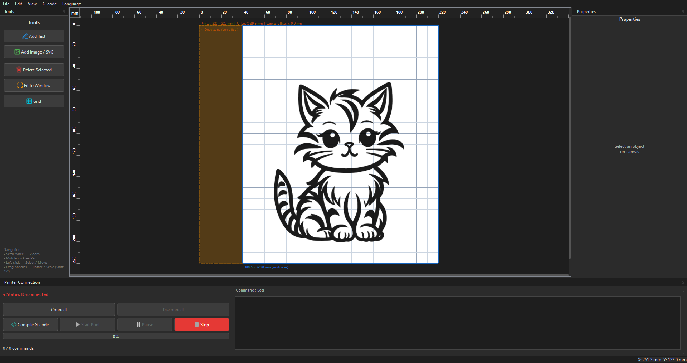

# PrinterPen


Transform your standard FDM 3D printer (running Marlin firmware) into a high-precision CNC pen plotter. **PrinterPen** gives you an intuitive desktop design canvas, powerful raster and vector processing, advanced area hatching, automatic travel path optimization, and direct USB serial streaming with real-time hardware synchronization.


---

## Key Features

- **Vector & Raster Import**:
  - Full **SVG** import with layer preservation and multi-color palette extraction.
  - Multi-method **Raster Image Vectorization**:
    - **Centerline / Skeleton Thinning** (Zhang-Suen): Extracts a single, smooth medial spine for hand sketches, signatures, and line art without ugly double contours.
    - **Canny Edge Detection**: Detailed contour extraction with fine-tunable sensitivity thresholds.
    - **Binary Contours**: High-contrast outline tracing.

- **Area Infill & Shading**:
  - Fill solid dark regions or vector shapes with **6 customizable infill patterns**:
    - **Linear Hatch (Diagonal)**: Continuous serpentine zig-zag paths with minimal pen lifts.
    - **Cross-Hatch (Grid)**: Rich 90° cross-hatching for deep textures.
    - **Concentric Inset (Shells)**: Smooth inward offset contours following the natural shape geometry.
    - **Honeycomb & Triangle Mesh**: Geometric wireframe fills.
    - **Adaptive Tonal Shading**: Automatically modulates line density based on local image brightness (sparser lines in highlights, denser lines and cross-hatching in deep shadows) with an interactive **Shadow Range** slider.

- **Typography & Font Tool**:
  - Create multiline text with any system font or custom TTF/OTF.
  - Generates true vector bezier outlines with instant canvas preview.
  - Letter glyph infill hatching for solid or shaded typography.
  - Dynamic **custom font hot-reloading**: drop any `.ttf` or `.otf` file into the `fonts/` folder, and it instantly becomes available without restarting the app.

- **Printer & Hardware Calibration**:
  - Configurable bed dimensions and physical pen mount offsets (X/Y relative to nozzle).
  - Drawing height ($Z_{draw}$) with micro-step **Pressure Fine-Tune** and rapid travel lift ($Z_{lift}$).
  - Customizable G-code initialization (header) and finish (footer) scripts.
  - Automatic persistence of calibration parameters across sessions (`plotter_settings.json`).

- **Direct USB Serial Streaming**:
  - Built-in G-code compiler and sender supporting standard **Marlin** 3D printer firmware.
  - On-demand **«Compile G-code»** button: evaluate stroke complexity and exact command count before printing.
  - Real-time command counter and progress bar synchronized with hardware serial `ok` acknowledgments.
  - Live command log, pause, resume, and emergency stop controls.

- **Modern Dual-Language GUI**:
  - Crisp dark and light themes with instant hot-switching.
  - Interactive millimetric rulers and canvas grid with coordinate readouts.
  - Object **Hide** and **Lock** properties for easy alignment of multi-color or multi-stage drawings.
  - Full **English** and **Russian** dual-language interface.

## Requirements & Tested Hardware

- **Python**: `3.10` or higher (tested and developed on **Python 3.14.2**)
- **Operating System**: Windows 10/11, Linux (Ubuntu/Debian), or macOS
- **Hardware Compatibility**: Any FDM 3D printer running **Marlin** firmware connected via USB, with a pen mounted to the print head.
- **Tested & Verified Configuration**:
  - **3D Printer**: Creality Ender-3 V3 SE
  - **Firmware**: Marlin v1.0.6
  - **Mainboard / Hardware**: `CR4NS200320C13` (BEP)

## Installation & Getting Started

### 1. Clone the Repository

```bash
git clone https://github.com/Kobzavr/PrinterPen.git
cd printer-pen
```

### 2. Create and Activate a Virtual Environment

- **Windows (Command Prompt / PowerShell)**:
  ```bash
  python -m venv venv
  venv\Scripts\activate
  ```

- **Linux / macOS**:
  ```bash
  python3 -m venv venv
  source venv/bin/activate
  ```

### 3. Install Dependencies

```bash
pip install -r requirements.txt
```

### 4. Launch the Application

```bash
python main.py
```

## Quick Workflow Guide

1. **Configure Printer**:
   - Open **Edit → Printer Settings** (or press `Ctrl+P`).
   - Set your printer bed dimensions, pen mount offset, Z drawing height, and travel speeds.
2. **Add Artwork**:
   - Use the **Text Tool** to add typography, or import an **SVG** / raster image (`.png`, `.jpg`, `.bmp`).
3. **Customize Infill & Vectorization**:
   - In the **Properties** panel on the right, select vectorization mode and choose an infill pattern (e.g. *Adaptive Tonal*).
4. **Compile & Preview**:
   - Click the **«Compile G-code»** button (`</>`) on the bottom connection dock to inspect total command count, or toggle **View → Show G-code Preview**.
5. **Print**:
   - Select your printer's COM port, click **Connect**, then click **«Start Print»** (`▶`).

## Disclaimer

> [!WARNING]
> **Use at your own risk.** Converting a 3D printer into a pen plotter involves direct CNC machine control and physical toolhead modifications.
> - Always verify your pen mount clearance, homing behavior, and Z-axis drawing heights carefully before starting a print job.
> - Incorrect Z offsets or invalid coordinate limits may cause the pen or nozzle to collide with and damage the print bed surface or mechanical components.
> - This software is provided **"as is"**, without warranty of any kind, express or implied. Under no circumstances shall the authors or contributors be held liable for any hardware damage, bed surface wear, stepper motor strain, or other losses resulting from the use of this software.

## License

This project is licensed under the **Creative Commons Attribution-NonCommercial-ShareAlike 4.0 International Public License (CC BY-NC-SA 4.0)**.

See the full [`LICENSE`](LICENSE) file for legal details.

## Credits & Authorship

Developed in collaboration with **Google Gemini**.

